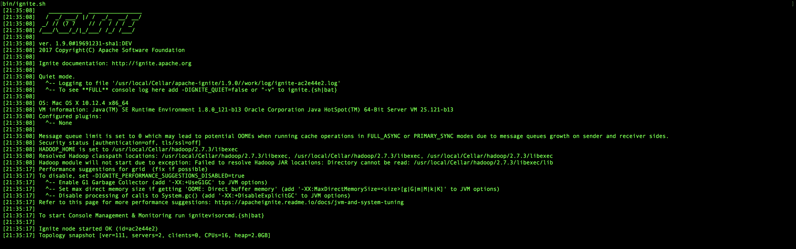
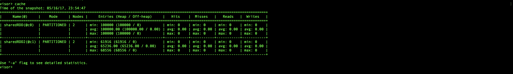

 
 
# Apache-Ignite

This section is dedicated to Apache Ignite [:mag:](https://ignite.apache.org/index.html)

Before starting the first step is to build a sand box to demonstrate the usage of Ignite. From an oldies: :older_man: like me having grown in the technology in the ealy 80ies, I always appreciate physical environemnt when possible over virtual. I have this mania to install everything from scratch even thouh I love mesos, docker:whale: and all the family :family:. However I like to climb to learn the system side of it, it has proven to me (THAT WORKS FOR ME, DOES NOT MEAN IT WORKS FOR YOU)in my long career that concepts are more profounded anchor that way.

## Intallation


I follow the following[:mag:](https://apacheignite.readme.io/docs/getting-started) procedure and it works perfecly to me :ok_hand:. I have done on MACOS Siera and ubuntu 16.04. I push the bounderies to try on installing with heterogenous hadoop and spark just for fun (this is a way you discover how powerful and solid are some technologies, I am very impressed for the number of years I practice Hadoop Stack about the stability and the way works seemlessly despite the many commment I read.

I built my stack on both OS using the following option, replacing `adoop.version` by 2.7.3 on my MAC and 2.7.2 on my ubuntu. I am sure I will have to align my versions in my cluster later on, but I have pushed the limit as a experiment on its own. I have spark 2.1.0 on MACOS ans 2.0.0 on ubuntu :fearful:. For the reason of spark 2.0.0, I have chosen ignite 1.9.0 :stuck_out_tongue_winking_eye:.

```
# Build In-Memory Hadoop Accelerator release
# (optionally specify version of hadoop to use)
$ mvn clean package -DskipTests -Dignite.edition=hadoop [-Dhadoop.version=X.X.X]
```

I tested with following procedure [here:eyes:](https://apacheignite-fs.readme.io/docs/testing-integration-with-spark-shell)

 :shit:[here](./TestingIgnite.md) under in case the link is broken.


For increasing visual while testing I created several workers in spark.


*bin/ignite.sh*


*bin/ignitevisorcmd.sh - command top to show two nodes not loaded*


*bin/ignitevisorcmd.sh - command top to show two nodes with activity and several workers working*



*bin/ignitevisorcmd.sh - Cache*


## Configuration

### spark-conf.sh

```shell
# Optionally set IGNITE_HOME here.
# IGNITE_HOME=/path/to/ignite

export IGNITE_VER=2.0.0
export IGNITE_HOME=/usr/local/Cellar/apache-ignite/$IGNITE_VER

IGNITE_LIBS="${IGNITE_HOME}/libs/*"

for file in ${IGNITE_HOME}/libs/*
do
    if [ -d ${file} ] && [ "${file}" != "${IGNITE_HOME}"/libs/optional ]; then
        IGNITE_LIBS=${IGNITE_LIBS}:${file}/*
    fi
done

export SPARK_CLASSPATH=$SPARK_CLASSPATH:$IGNITE_LIBS
```
Note
---
when using spark 2.1.1 with ignite 2.0.0, the library of ignite will overwrite the spark ones, this works fine anyway.

### Eclipse configuration

include all spark jars and ignite in the build path with order ignite first before spark'one. Details of classpath [here:eyes:](MyFirstIgnite/.classpath)


